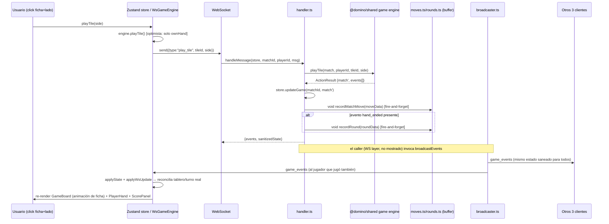

# 🧠 Mapa Mental — Flujo Completo de "Partida Rápida" (Dominó Occidental)

> Cobertura: click del usuario → cola de matchmaking → WS de notificación → creación de match → WS de juego → jugadas → timers/desconexión → persistencia DB → cierre de partida.

---

## 0. Visión general (macro-flujo)

```mermaid
flowchart TD
    A[Usuario click "Jugar ahora"] --> B[useMatchmaking.joinQueue]
    B --> C[POST /api/v1/matchmaking/quick]
    C --> D[matchmakingRoutes: auth + resolvePartner + enqueue]
    D --> E[QuickMatchButton pasa a estado 'queued']
    E --> F[Hook abre WS /ws/matchmaking/:userId]
    F --> G[matchmakingWsHandler.open: verifyToken + register en UserChannelManager]

    H[setInterval 2s en server.ts] --> I[processMatchmaking]
    I --> J[queue.findMatch: pair-priority o ELO scan]
    J -->|match encontrado| K[shuffle+deal+initializeMatch+startHand]
    K --> L[createGame en store, status='waiting']
    L --> M[dequeue 4 jugadores]
    M --> N[pushToUser match_found a los 4 vía UserChannelManager]
    N --> O[Cliente WS matchmaking recibe match_found]
    O --> P[window.location.href a /match/:id?playerId=X]

    P --> Q[MatchPage monta useWebSocket]
    Q --> R[WS /ws/game/:matchId/:playerId abre]
    R --> S[server: WsPlugin registra conexión]
    S --> T{4 jugadores conectados?}
    T -->|sí| U[cancela pendingTimeout de 30s, status→in_progress, timerManager.startMatch]
    T -->|no en 30s| V[removeGame + re-enqueue + match_cancelled]

    U --> W[Loop de juego: play_tile / pass / leave]
    W --> X[handler.ts: handleMessage]
    X --> Y[broadcastEvents a los 4 vía sendFn]
    Y --> Z[Frontend: ws-engine.applyState + zustand store.applyWsUpdate]
    Z --> AA[Render: GameBoard / PlayerHand / ScorePanel]

    W --> AB[Timers: heartbeat 5s, turnChecker 2s, disconnect 60s]
    AB --> AC{match_ended / match_abandoned?}
    AC -->|sí| AD[persistMatch: insert matches + flush rounds/moves en TX]
```

---

## 1. FRONTEND — El click del usuario

### 1.1 `QuickMatchButton` (`quick-match-button.tsx`)
- Usa el hook `useMatchmaking()`.
- Estados posibles: `idle → queued → matched` (o `error`).
- Render condicional:
  - `matched`: spinner "¡Partida encontrada! Redirigiendo..."
  - `queued`: muestra posición en cola + tiempo de espera (contador local) + botón "Salir de la cola"
  - `idle`: botón "Jugar ahora" (dispara `joinQueue`)
- También usa `useOnlineCount(60_000)` para mostrar jugadores online (polling cada 60s).

### 1.2 `useMatchmaking` hook — el corazón del cliente de cola

**Estado interno:** `status`, `queuePosition`, `waitTimeMs`, `queueCount`, `matchId`, `error`, `isJoining`.

**Refs:** `wsRef` (WS de matchmaking), `waitIntervalRef` (contador de segundos), `statusRef` (evita stale closures).

#### `joinQueue()` — flujo paso a paso
1. Guard: si ya está `queued` o `matched`, no hace nada (evita doble-join).
2. Obtiene `session.access_token` de Supabase (`supabase.auth.getSession()`).
3. Si no hay sesión → `error = "Not authenticated"`.
4. `fetch POST /api/v1/matchmaking/quick` con header `Authorization: Bearer <token>`.
5. Maneja `409` → "Already in queue"; otros errores → "Failed to join queue".
6. Con éxito: `status = "queued"`, guarda `position`/`queueCount` de la respuesta.
7. `startWaitCounter()`: `setInterval` cada 1000ms que incrementa `waitTimeMs` (solo visual, no viene del server).
8. `connectWs(session.user.id, session.access_token)`: abre el WebSocket de notificaciones.

#### `connectWs()` — canal de push de matchmaking
- Conecta a `ws://.../ws/matchmaking/:userId?token=<jwt>`.
- `onmessage` interpreta 3 tipos de mensaje:
  - **`match_found`**: guarda `matchId`, `status="matched"`, `cleanupResources()` (cierra WS + limpia interval), y hace **`window.location.href`** (navegación dura, no `router.push`) a `/match/:matchId?playerId=<userId>`.
  - **`queue_position_update`**: actualiza `queuePosition`/`queueCount` (aunque el backend actual — ver §2 — **no emite este evento todavía**; es un placeholder de UI).
  - **`match_cancelled`**: vuelve a `idle`, muestra error "Match cancelled — re-queueing...", limpia el error a los 2s (no vuelve a encolar automáticamente en el cliente).
- `onclose`: solo limpia `wsRef` (no hay reconexión automática para el canal de matchmaking, a diferencia del WS de juego).

#### `leaveQueue()`
1. `cleanupResources()` (cierra WS local, para el contador).
2. `POST /api/v1/matchmaking/leave` con el token (best-effort, ignora fallos).
3. Resetea todo el estado local a `idle`.

#### Cleanup al desmontar
- Si el componente se desmonta estando `queued`, dispara un `leave` fire-and-forget al servidor.

---

## 2. BACKEND — Rutas REST de matchmaking (`routes/matchmaking.ts`)

### 2.1 `POST /matchmaking/quick`
1. `extractUserId(headers)`: valida header `Authorization: Bearer <token>` (aquí el "token" es literalmente el string después de `Bearer `, no se decodifica aquí).
2. `verifyToken(token)` → objeto `user` con `user.sub` (JWT verification real, ver §2.4).
3. Chequea si `userId` ya está en `queue.getQueue()` → si sí, `409 already_in_queue`.
4. **Resolución de pareja** (`resolvePartner(userId)`):
   - Query SQL cruda a la tabla `pairs` (sin schema Drizzle) filtrando `status='active'` y `user_a`/`user_b` = userId, ordenado por `priority ASC`, `LIMIT 1`.
   - Si hay error de DB → captura y retorna `null` (fallback silencioso a solo).
5. Si hay partner **y** el partner ya está en la cola → `partnerInQueue = true`.
6. **ELO actual**: hardcodeado a `1200` (TODO explícito en el código — no se lee de `profiles` todavía).
7. Enqueue:
   - Si pareja completa en cola → `eloType: "pair"`, guarda `pairId` y `partnerId`.
   - Si no → `eloType: "individual"`.
8. Responde `{ queued: true, position, queueType }`.

### 2.2 `POST /matchmaking/leave`
- Verifica token, busca entry en cola.
- Si el usuario tenía `partnerId` registrado, **también dequeue al partner** (comportamiento importante: salir de la cola como pareja saca a ambos).

### 2.3 `GET /matchmaking/status`
- Si no está en cola: `{inQueue:false, position:0, estimatedWait:0, queueCount}`.
- Si está en cola: calcula `position` por índice en el array y `estimatedWait` = tiempo de espera del jugador **más antiguo** de toda la cola (no el propio) en segundos.

### 2.4 `verifyToken` (auth.ts)
- JWT HS256 verificado manualmente con `Bun.CryptoHasher` (sin librerías externas).
- Decodifica base64url con `atob()` nativo de Bun.
- Comparación de firma **timing-safe** (previene timing attacks).
- Valida expiración (`exp`).
- Extrae `userId` desde `payload.userId ?? payload.sub`.
- ⚠️ Nota: esta es la versión "REST" de auth. El WS de matchmaking usa `verifyToken` desde `../auth/verify-token` (import distinto, probablemente async/wrapper — el de `auth.ts` mostrado es síncrono).

---

## 3. BACKEND — Algoritmo de cola (`game/matchmaking.ts`)

### 3.1 Estructura de datos
```ts
Map<userId, QueueEntry>  // { userId, elo, joinedAt, pairId?, partnerId?, eloType }
```
- `enqueue`/`dequeue`: operaciones simples sobre el Map (`Map.set` sobreescribe si ya existe la key).

### 3.2 `findMatch()` — orden de prioridad
```
1. findPairMatch(entries)  → pre-pase de parejas
2. Si no hay match de parejas → escaneo ELO individual (FIFO + ventana deslizante)
```

#### 3.2.1 Pre-pase de parejas (`findPairMatch`)
1. Agrupa entradas por `pairId` en un `Map<pairId, entries[]>`.
2. Filtra solo pares **completos** (ambos miembros en cola simultáneamente).
3. Si hay **menos de 2 pares completos** → `null` (no se puede armar mesa de 4 con parejas).
4. Ordena pares por ELO promedio ascendente (FIFO por antigüedad implícita).
5. Para cada par "ancla", calcula `range` según su tiempo de espera (misma tabla de ventanas ELO que el escaneo individual) y busca otro par cuyo promedio ELO esté dentro de ese rango.
6. Retorna `MatchGroup` con los 4 `playerIds` (2+2), rango de ELO y tiempo de espera del ancla.

#### 3.2.2 Escaneo ELO individual (fallback)
1. Ordena todas las entradas por `joinedAt` (FIFO, el más antiguo primero).
2. Para cada `candidate`:
   - Calcula `waitTime = now - joinedAt`.
   - `range = getEloRange(waitTime)` → ventana deslizante:

| Tiempo esperando | Rango ELO permitido |
|---|---|
| 0 – 10s | ±200 |
| 10s – 30s | ±400 |
| 30s – 60s | ±600 |
| >60s | ±600 (acepta a cualquiera) |

   - Filtra candidatos (excluyendo a sí mismo) cuyo `|elo - candidate.elo| <= range`.
   - Si hay **al menos 3** → toma los **3 más cercanos en ELO** (`sort` + `slice(0,3)`), arma el grupo de 4.
   - Retorna inmediatamente el primer match encontrado (no busca el "mejor" global, es greedy).
3. Si ningún candidato junta 4 → `null`.

⚠️ **Detalle importante**: el escaneo por candidato es **O(n²)** en el peor caso (para cada candidato, filtra sobre todas las entries). Con colas grandes esto podría ser costoso, pero para el tamaño esperado (decenas/cientos) es aceptable.

### 3.3 `cleanupStale()`
- Elimina del Map cualquier entrada con más de `QUEUE_CLEANUP_THRESHOLD_MS` (60s) esperando.
- Se ejecuta cada `CLEANUP_INTERVAL_MS` (30s) vía `startCleanupScheduler`.
- ⚠️ Esto significa que si alguien espera **más de 60s sin encontrar match**, es **eliminado silenciosamente de la cola** sin notificación al cliente (el cliente seguiría mostrando "En cola" indefinidamente salvo timeout propio, que no existe en el hook actual).

### 3.4 `processMatchmaking(deps)` — puente cola → juego
Ejecutado cada 2s desde `server.ts` (`setInterval`).

1. `queue.findMatch()` → si `null`, retorna.
2. `shuffle(createDeck())` + `deal(deck)` → reparte 4 manos de **10 fichas c/u** + `pool` (15 fichas restantes para redeals por bloqueo).
3. `matchId = crypto.randomUUID()`.
4. `initializeMatch(matchId, hands, pool)` → crea `MatchState` base.
5. `startHand(match)` → arranca la primera mano (determina quién empieza, normalmente el doble-9 o mayor suma según reglas del engine `@domino/shared`).
6. **Sobrescribe los IDs de jugador**: el engine genera IDs internos (p0-p3), se reemplazan por los `userId` reales del grupo, **preservando el orden posicional** (importante para asientos consistentes).
7. `status = "waiting"` (no `in_progress` todavía — espera que los 4 conecten por WS de juego).
8. `createGame(matchId, startedMatch)` → persiste en el store en memoria (`Map` de `store.ts`).
9. `queue.dequeue()` para los 4 jugadores.
10. `pushToUser(playerId, {type:"match_found", matchId, playerIds, timestamp})` a cada uno vía `UserChannelManager`.

### 3.5 `resolvePartner` y `fetchPlayerProfiles`
- `resolvePartner`: SQL raw a tabla `pairs` (sin Drizzle schema).
- `fetchPlayerProfiles`: usa Drizzle (`profilesTable`) con `inArray`, fallback a `Player XXXX` si falla la DB o faltan filas. Se llama **de forma asíncrona y no bloqueante** después de crear el match (`server.ts`), así que hay una ventana donde el match existe con nombres placeholder hasta que resuelve.

---

## 4. WS de Matchmaking (`ws/matchmaking-ws.ts`) — canal ligero de push

### 4.1 Propósito
Canal por-usuario (no por-partida) para notificaciones server-initiated: `match_found`, potencialmente `queue_position_update` (no implementado aún en el backend mostrado).

### 4.2 Ciclo de vida
- **`open(ws)`**:
  1. Extrae `?token=` de la query string.
  2. Sin token → `ws.close(4001, "Missing authentication token")`.
  3. `tokenVerifier(token)` (async) → si fue exitoso:
     - Chequea que el socket no se haya cerrado mientras se verificaba (`__closed` flag) — **previene condición de carrera** entre verificación async y cierre del socket.
     - Chequea `readyState === 1` (defensa extra).
     - `userChannelManager.register(userId, ws)`.
     - Guarda `userId` en `ws.data` para el handler de `close`.
     - Envía `{type:"connected", userId}` como ack.
  4. Token inválido/expirado → `close(4001, ...)`.
- **`message(ws, rawData)`**: solo procesa `pong` de heartbeat del cliente (no hay lógica adicional; es un no-op reconocido).
- **`close(ws)`**: marca `__closed=true` y llama `userChannelManager.disconnect(userId)`.

### 4.3 `UserChannelManager` (`user-channel.ts`)
- `Map<userId, WsConnection>` plano (1 conexión activa por usuario — si abre 2 tabs, la segunda sobrescribe la referencia de la primera en el Map).
- `pushToUser`: `try/catch` silencioso — si el `ws.send` falla, no lanza error hacia arriba (conexión "stale" se ignora, no se limpia automáticamente hasta el próximo `close`).

---

## 5. WS de Juego — conexión (`server.ts` + módulos `ws/*`)

> Nota: `createWsPlugin` y `createConnectionManager` no están en los documentos subidos, pero se puede reconstruir su comportamiento por cómo los usa `server.ts`, `timer-manager.ts` y `connection.ts` (funciones puras de dominio).

### 5.1 Ruta: `WS /ws/game/:matchId/:playerId`
- Se abre desde `useWebSocket` del frontend inmediatamente al montar `MatchPage`.
- `server.ts` **envuelve** `plugin.ws.open` con lógica adicional:
  ```
  gameWsOpen(ws)                      // lógica interna del plugin (registrar conexión)
  → si matchId tiene un pendingTimeout (30s de espera de conexión)
     → si ya hay 4 conectados → clearTimeout(pendingTimeout)
  ```
- Esto es el mecanismo que **cancela el timeout de 30s** (`MATCH_FOUND_TIMEOUT_MS`) una vez los 4 jugadores abrieron su WS de juego.

### 5.2 Timeout de conexión (30s)
- Al crear el match (`processMatchmaking`), se arma un `setTimeout(..., MATCH_FOUND_TIMEOUT_MS)`.
- Si pasan 30s y **no** hay 4 conectados:
  1. `removeGame(matchId)` — borra el match del store.
  2. Re-encola los 4 `playerIds` con ELO por defecto 1200 (**pierde el ELO real si ya se había resuelto antes** — otro TODO implícito).
  3. `pushToUser(playerId, {type:"match_cancelled", matchId, reason:"connection_timeout"})` a los 4 vía el canal de matchmaking (no el de juego).
- El frontend (`useMatchmaking`) escucha `match_cancelled` y vuelve a `idle`, pero **no re-lanza automáticamente `joinQueue()`** — el usuario debe volver a hacer click.

### 5.3 Endpoint de desarrollo
- `POST /api/v1/dev/create-match`: crea una partida sin auth ni cola, para testing local directo (bypassa todo el flujo de matchmaking).

---

## 6. Manejo de mensajes de juego (`handler.ts`)

### 6.1 `handleMessage(store, matchId, playerId, message)`
Router central de todos los mensajes WS del juego.

```
match = store.getGame(matchId)
  → si no existe: game_error MATCH_NOT_FOUND

switch(message.type):
  "play_tile" → playTile(match, playerId, tileId, side)
  "pass"      → passTurn(match, playerId)
  "leave"     → forfeitMatch(match, playerId, new Date())
  default     → game_error INVALID_MESSAGE (pero SÍ incluye sanitizedState)
```

### 6.2 Detección de cambio de estado
- Compara `result.match !== match` (comparación por **referencia**, no deep-equal) para saber si hubo mutación real vs. un error (las funciones puras del engine devuelven la **misma referencia** en caso de error, y una **nueva** en caso de éxito — patrón inmutable consistente).
- Solo si cambió: `store.updateGame(matchId, result.match)`.

### 6.3 Registro de movimientos (`recordMatchMove`, fire-and-forget)
- Para `play_tile` exitoso: construye `MoveRecord` extrayendo el **último tile del tablero** (`board.tiles[length-1]`), calcula `playerIndex`, guarda `boardLeftEnd/RightEnd` post-jugada.
- Para `pass` exitoso: `MoveRecord` con `isPass:true`.
- `void recordMatchMove(moveData)` — **no bloquea el game loop**, se buffer-iza en memoria (`moves.ts`) hasta el flush final.

### 6.4 Registro de rondas (`hand_ended` → `recordRound`)
- Busca en `result.events` si hay un evento `hand_ended`.
- Construye `RoundRecord`: `roundId` vía `ensureRoundId` (reutiliza UUID si ya fue generado por un move anterior de esa ronda — importante para la FK `match_moves.round_id`).
- **Enriquecimiento**: busca el evento `hand_scored` (que siempre acompaña a `hand_ended`) para llenar `winningPair`, `points`, `handScores` reales (el objeto inicial usa placeholders `0`).
- `void recordRound(roundData)` — fire-and-forget, buffer en memoria.

### 6.5 Respuesta
```ts
{ events: result.events, sanitizedState: sanitizeState(result.match) }
```
- `sanitizeState` (de `@domino/shared`, no mostrado) presumiblemente oculta las manos de los otros jugadores (anti-cheat: cada cliente solo debe ver su propia mano completa).

---

## 7. Broadcasting — enrutamiento privado de eventos (`broadcaster.ts`)

### 7.1 `broadcastEvents(events, matchId, actingPlayerId, sendFn, playerIds, state)`
- **Regla de privacidad clave**: `game_error` → **solo** al `actingPlayerId`. Todos los demás tipos de evento (11 tipos) → **los 4 jugadores**.
- Agrupa eventos por destinatario en `Map<playerId, GameEvent[]>` para enviar **un solo mensaje por jugador** con todos sus eventos (no N mensajes separados) — optimización de red.
- Si `playerIds` no se pasa o está vacío → `console.error` (bug guard) y no envía nada — **falla ruidosamente** en vez de silenciosamente, indicando que es una invariante que todos los callers deben respetar.
- Cada envío está en `try/catch` individual: si falla para un jugador, los demás igual reciben su mensaje.

### 7.2 `sendState(playerId, state, sendFn)`
- Utilidad para reconexión/join inicial: envía solo el snapshot de estado sin eventos (`events: []`).

---

## 8. Timers — el "reloj" del servidor (`timer-manager.ts`)

Este módulo orquesta **3 tipos de timers** por partida, todos con primitivas inyectables (testing determinístico).

### 8.1 `startMatch(matchId, playerIds)` — se llama cuando los 4 conectan

#### a) Heartbeat por jugador (cada `HEARTBEAT_MS`, típicamente 5s)
- Para cada jugador, un `setInterval` que chequea `getConnectionReadyState(playerId)`:
  - **`readyState === 3` (CLOSED)** → desconexión **inmediata y definitiva** (`disconnectPlayer` + broadcast).
  - **`readyState === 1` (OPEN)** → resetea contador de fallos.
  - **Otro (`CLOSING` u desconocido)** → incrementa `heartbeatFailures[playerId]`.
    - Al llegar a **3 fallos consecutivos** (~15s con intervalo de 5s) → desconecta.
- Este mecanismo detecta desconexiones "silenciosas" (el socket queda en estado ambiguo sin disparar `close` inmediatamente).

#### b) Turn checker (cada 2000ms, fijo — no configurable via `HEARTBEAT_MS`)
- Si `pausedMatches.has(matchId)` → **skip** (ver §8.3, se pausa cuando el jugador en turno está desconectado, dándole toda la ventana de abandono en vez de comerle el turno).
- `checkTimeout(match, now)` (función pura externa, del dominio del juego) → detecta si el turno actual excedió `TURN_TIMEOUT_MS` (45s según constantes).
- Si hay eventos:
  1. Persiste el nuevo estado.
  2. `broadcastEvents(...)` a todos.
  3. Si el evento incluye `round_started` (redeal tras bloqueo) → envía a **cada jugador individualmente** su nueva mano (`yourHand: p.hand`) — esto **no puede ir en el broadcast general** porque cada uno tiene una mano distinta.
  4. Si hay `hand_ended` en los eventos → registra la ronda (mismo patrón que `handler.ts`, duplicado aquí para el camino de timeout).
  5. Si hay `match_ended`/`match_abandoned` → `startedMatches.delete(matchId)` + `persistMatch(...)` fire-and-forget.

### 8.2 `registerDisconnect(matchId, playerId, disconnectedAt)`
- Guarda el registro de desconexión en `disconnectRecords`.
- **Si el jugador desconectado es el que tiene el turno actual** → `pausedMatches.add(matchId)` (pausa el turn-checker para no forzarle un pase mientras tiene ventana de reconexión).
- Arma un `setTimeout` de `ABANDONMENT_THRESHOLD_MS` (15s según el código; nota: el `AGENTS.md` dice 60s pero la implementación actual usa 15s):
  - Al disparar: `checkAbandonment(match, record, now)` — función pura que decide si ya pasó el umbral y marca `status='abandoned'`.
  - Si hay eventos → broadcast + `persistMatch` si el evento fue `match_abandoned`.
  - Limpia el registro tras disparar.

### 8.3 `cancelDisconnect(matchId, playerId)` — reconexión exitosa
1. Limpia el timeout de abandono pendiente.
2. `pausedMatches.delete(matchId)` — reanuda el turn-checker.
3. **Refresca el deadline del turno**: si el reconectado es quien tiene el turno, le da **45s frescos** desde `nowFn()` (no continúa desde donde se quedó — reset completo, generoso con el jugador que tuvo problemas de red).

### 8.4 `stopMatch(matchId)` / `stop()`
- Limpieza completa de todos los intervals/timeouts asociados a una partida (o a todas, en shutdown).

---

## 9. Funciones puras del dominio (`connection.ts`) — lógica de conexión/abandono

Todas siguen el patrón **`ActionResult = { match, events }`** inmutable (nueva referencia si hubo cambio, misma referencia si fue no-op).

| Función | Responsabilidad | Casos especiales |
|---|---|---|
| `disconnectPlayer` | `isConnected=false`, emite `player_disconnected` con `reconnectWindowMs` | No-op si ya estaba desconectado |
| `reconnectPlayer` | `isConnected=true`, emite `player_reconnected` | No-op si ya estaba conectado |
| `checkReconnectWindow` | Query pura (no ActionResult) — calcula `windowExpired`/`secondsLeft` | — |
| `forcePassForDisconnected` | Fuerza un pase cuando le toca el turno a alguien desconectado | **No** chequea `isConnected` — confía en que la capa WS decida cuándo llamarlo. Chequea si el tablero queda bloqueado tras el pase forzado y dispara `handleHandEnd` en ese caso |
| `checkAbandonment` | Escalona: `<RECONNECT_WINDOW_MS` → no-op; entre ventana y `ABANDONMENT_THRESHOLD_MS` → emite `reconnection_window_expiring` (warning); `>=threshold` → `status='abandoned'` + `match_abandoned` | Solo actúa si `match.status === 'in_progress'` |
| `forfeitMatch` | Abandono **voluntario** (botón "Abandonar Partida" del frontend) | No-op si ya estaba `finished`/`abandoned`. Marca `isConnected=false` **y** `status='abandoned'` en un solo paso (no pasa por la ventana de reconexión) |

---

## 10. Persistencia en base de datos (buffer + flush transaccional)

### 10.1 Por qué el buffering
- `match_moves` y `match_rounds` tienen FK hacia `matches`, pero la fila de `matches` **no existe** hasta que la partida termina (`persistMatch`).
- Por eso: **todo se acumula en memoria** (`Map`s módulo-scoped en `moves.ts` y `rounds.ts`) durante toda la partida, y se **flushea junto** cuando hay un evento terminal.

### 10.2 `moves.ts`
- `moveCounters: Map<matchId, number>` — autonumeración de `moveNumber`.
- `bufferedMoves: Map<matchId, BufferedMove[]>`.
- `recordMatchMove`: **siempre** buffer-iza (independiente de si hay DB conectada); el log a consola solo ocurre si `getDb()` retorna `null` (modo dev sin Supabase).
- Resuelve `roundId` vía `ensureRoundId` — **primera jugada de cada mano genera el UUID de ronda**, aunque el `RoundRecord` completo se registre después (al `hand_ended`).

### 10.3 `rounds.ts`
- `bufferedRounds: Map<matchId, RoundRecord[]>` + `roundIdLookup: Map<"matchId:roundNumber", uuid>`.
- `ensureRoundId` vs `recordRound`: la primera solo **reserva un UUID** (para que los moves puedan referenciarlo), la segunda **efectivamente agrega el RoundRecord al buffer**. Son operaciones distintas — un UUID reservado no implica que la ronda esté "grabada" (importante para `recordAbandonedRoundIfNeeded`, que chequea explícitamente si el buffer tiene la ronda, no solo si existe el lookup).
- `recordAbandonedRoundIfNeeded`: cubre el caso donde la partida se abandona **a mitad de mano** (nunca disparó `hand_ended`) — crea un `RoundRecord` stub con `reason:'abandoned'` para satisfacer la FK.

### 10.4 `matches.ts` — `persistMatch(state, events)`
Flujo transaccional final:
1. `extractTerminalData(state, events)` — busca `match_ended` o `match_abandoned` en los eventos; si no hay ninguno, retorna `null` (no persiste nada).
2. `recordAbandonedRoundIfNeeded(matchId, state)` — garantiza que la ronda en curso tenga aunque sea un stub.
3. `db.insert(matches).values(record)` — **fire-and-forget** (no bloquea el game loop).
4. En el `.then()` del insert: `db.transaction(tx => { flushMatchRounds(tx); flushMatchMoves(tx); })` — **rounds antes que moves** (respeta el orden de FK: `match_moves.round_id → match_rounds.id → matches.id`).
5. Si falla cualquier paso → `console.error`, la transacción hace rollback automático, **pero el juego en memoria ya terminó igual** (la persistencia es best-effort, nunca bloquea ni revierte el estado del juego).
6. Modo sin DB (`SUPABASE_DB_URL` no seteado): todo se loguea a consola en vez de insertarse.

---

## 11. FRONTEND — WS de juego y sincronización de estado

### 11.1 `useWebSocket(matchId, playerId, disabled)`

#### Inicialización del engine
- Crea un `WsGameEngine` con un **estado placeholder** (jugador propio con `id=playerId`, los otros 3 vacíos) — se reemplaza en el primer mensaje real del servidor.

#### `connect()` — reconexión con backoff exponencial
```
delay = min(1000 * 2^attempt, 30000)   // 1s, 2s, 4s, 8s, 16s, 30s (cap)
máximo 10 intentos, luego status = "disconnected" (se rinde)
```
- **No reconecta** si `matchStatus` ya es `finished` o `abandoned` (chequeo contra el store global antes de cada intento).
- Guard `wsRef.current !== ws` en **todos** los callbacks (`onopen`, `onmessage`, `onclose`) — previene que una conexión WS **obsoleta** (de un reintento anterior o de un match previo) pise el estado de la conexión **actual**. Este es un patrón defensivo clave para evitar "race conditions" de reconexión.

#### `onmessage` — procesamiento de `game_events`
Extrae del array `events` (con `find`, toma el primero de cada tipo — asume máximo 1 de cada tipo por mensaje):
1. `hand_scored` → `setHandOver({winningPair, points, scores})` → dispara el modal de fin de mano.
2. `match_abandoned` → guarda `matchAbandonedBy` en el store (para el overlay).
3. `player_passed` → `markPassed(playerId)` (badge visual "Se pasó").
4. `turn_timeout` con `forcedPass:true` → también `markPassed` (mismo badge, pase forzado por timeout).
5. `tile_played` → `clearPassed()` (limpia el badge en cuanto alguien juega).
6. Si viene `state` (siempre que hay cambio real):
   - Calcula `playerIndex` **buscando el `playerId` propio dentro del array `players` del servidor** (fuente de verdad — no confía en un índice fijo del cliente).
   - `engine.applyState(sanitized, yourHand, playerIndex)`.
   - **Primera vez**: conecta el engine al store global (`store.setEngine`).
   - Siempre: `store.applyWsUpdate(sanitized, yourHand)`.

### 11.2 `applyWsUpdate` (zustand store) — reconciliación de estado
- Detecta transiciones de conexión por jugador comparando `sanitized.players[i].isConnected` vs. el estado previo:
  - `false` recién ahora → `disconnectedSince.set(id, Date.now())` (para mostrar el indicador visual de "desconectado hace Xs").
  - `true` → `disconnectedSince.delete(id)`.
- `roundChanged = sanitized.roundNumber !== prevRound` → limpia `lastPassedPlayerId` en cambio de ronda.
- `ownHand: yourHand ?? store.game.ownHand` — **si el mensaje no trae `yourHand`** (ej. un `game_events` de otro jugador jugando), conserva la mano local existente en vez de vaciarla.

### 11.3 `playTile` / `pass` en el store — modo remoto vs local
- **Modo remoto (`engine.remote === true`)**: actualización **optimista** solo de la mano propia (`engine.hand`) — el resto del estado (tablero, turno, tamaños de mano ajenos) se reconcilia cuando llega el broadcast del servidor. No hay validación de reglas en el cliente para el resultado — confía en el server.
- **Modo local (CPU)**: procesamiento síncrono completo vía `LocalGameEngine`, sin red.

---

## 12. Ciclo completo de vida de una jugada (`play_tile`) — secuencia end-to-end



---

## 13. Puntos de diseño notables / posibles riesgos (para tu auditoría)

1. **`heartbeat` cada 5s con 3 fallos = 15s + `turn timeout` de 45s**: son mecanismos independientes; un jugador puede seguir "conectado" según el turn-checker pero ya estar heartbeat-fallando. Vale la pena verificar que no compitan (ej. que `disconnectPlayer` no se llame dos veces por rutas distintas casi al mismo tiempo — ambos caminos ya usan la misma función pura no-op-si-ya-desconectado, así que es seguro, pero generan doble intento de broadcast).
2. **Cola: `cleanupStale` a los 60s sin aviso al cliente** — el usuario puede quedar "colgado" viendo "En cola" sin saber que fue removido; el frontend no tiene un timeout propio de cola para reintentar o avisar.
3. **`queue_position_update` nunca se emite** desde el backend mostrado — es un evento que el frontend sabe interpretar pero el servidor no dispara. Si quieres implementarlo, iría en el loop de `processMatchmaking` o en un scheduler aparte que recalcule posiciones y haga `pushToUser` a cada uno en la cola.
4. **ELO hardcodeado a 1200** tanto en `/matchmaking/quick` como en el re-enqueue tras `connection_timeout` — el sistema de ELO real (`elo.ts`) existe y está completo, pero **no está conectado todavía** al flujo de matchmaking.
5. **`window.location.href` (navegación dura)** al redirigir a la partida, en vez de `router.push` — esto fuerza un reload completo de la SPA. Probablemente intencional para garantizar estado limpio, pero vale confirmarlo.
6. **`turnCheckerInterval` fijo en 2000ms** en el código (no usa una constante configurable como `HEARTBEAT_MS`) — inconsistencia menor de estilo vs. mantenibilidad.
7. **Doble lógica de `hand_ended`→`recordRound`** duplicada entre `handler.ts` (jugadas normales) y `timer-manager.ts` (timeouts) — mismo patrón copiado dos veces; candidato a extraer una función compartida.
8. **Reconexión del WS de juego SÍ tiene backoff exponencial (10 intentos)**, pero el **WS de matchmaking NO** — si se cae mientras se espera un match, el usuario no se reconecta automáticamente a las notificaciones.

---

## 14. Glosario rápido de eventos WS (deducidos del código)

| Evento (`GameEvent.type`) | Emisor | Alcance | Disparador |
|---|---|---|---|
| `game_error` | handler / connection.ts | Solo `actingPlayerId` | Errores de validación (match no encontrado, jugador no encontrado, índice inválido) |
| `player_disconnected` | connection.ts | Todos | Heartbeat falla o socket CLOSED |
| `player_reconnected` | connection.ts | Todos | Nueva conexión WS de un jugador ya en la partida |
| `reconnection_window_expiring` | connection.ts (`checkAbandonment`) | Todos | Pasó `RECONNECT_WINDOW_MS` pero no `ABANDONMENT_THRESHOLD_MS` |
| `match_abandoned` | connection.ts (`checkAbandonment` / `forfeitMatch`) | Todos | Umbral de abandono cumplido o `leave` voluntario |
| `turn_timeout` | connection.ts (`forcePassForDisconnected`) / engine | Todos | Turno vencido (45s) |
| `hand_ended` | engine del dominio | Todos | Mano terminada (vacío, bloqueo, forzado) |
| `hand_scored` | engine del dominio | Todos | Siempre acompaña a `hand_ended` con puntos |
| `round_started` | engine del dominio | Todos + `yourHand` individual | Redeal tras bloqueo |
| `player_passed` | engine del dominio | Todos | Pase voluntario |
| `tile_played` | engine del dominio | Todos | Jugada válida |
| `match_ended` | engine del dominio | Todos | Alguna pareja llegó a `TARGET_SCORE` |

